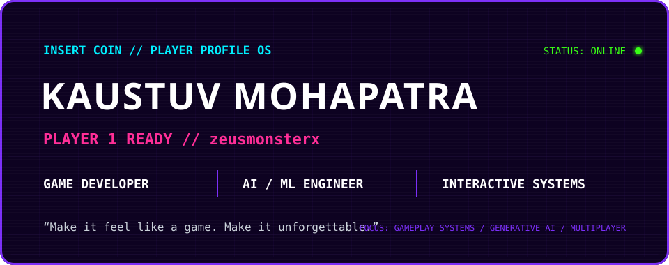
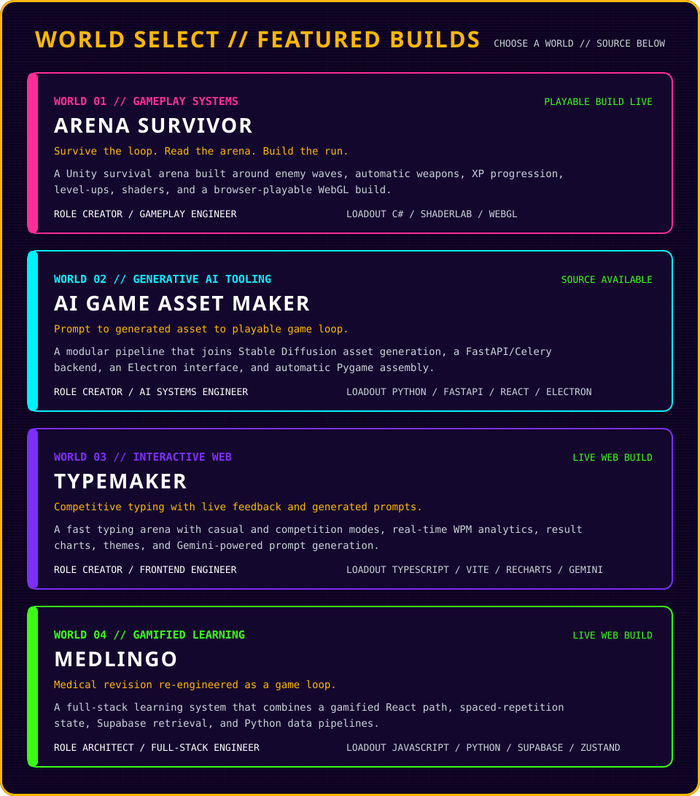

<!--
  KAUSTUV // PLAYER PROFILE OS
  Public presentation lives here. Editable profile data lives in profile/.
  NPC_MIRA: companion connection stable // morale +1
-->

<div align="center">



<a href="https://kaustuvm.itch.io/"></a>
<a href="https://kaustuvmohapatra.github.io/ResumeSite/"></a>
<a href="https://github.com/KaustuvMohapatra?tab=repositories"></a>
<a href="https://www.linkedin.com/in/kaustuv-mohapatra-b0538428b/"></a>

<br />

[](https://github.com/KaustuvMohapatra/KaustuvMohapatra/actions/workflows/profile-ci.yml)
[](https://github.com/KaustuvMohapatra/KaustuvMohapatra/actions/workflows/profile.yml)

</div>

## PLAYER PROFILE // SAVE IDENTITY

<!-- PLAYER_OS:PLAYER_PROFILE:START -->
```yaml
PLAYER:    Kaustuv Mohapatra
HANDLE:    zeusmonsterx
CLASS:     Game Developer + AI Engineer
BUILD:     Interactive Systems
FOCUS:
  - Gameplay Systems
  - Generative AI
  - Multiplayer
  - Interactive Web
STATUS:    ONLINE
```
<!-- PLAYER_OS:PLAYER_PROFILE:END -->

## MISSION LOG // BUILD PHILOSOPHY

> I build interactive worlds where game development and AI meet.<br />
> Mechanics, feedback, and responsiveness are part of the engineering.<br />
> I like systems that feel alive, from gameplay loops to AI-enhanced tools.<br />
> The rule behind every build is simple: **game feel matters**.

## PLAYER SAVE // LIVE TELEMETRY



`PLAYER XP` is a playful profile metric, not an official GitHub score:

```text
XP = public source repos × 100
   + public commits in the last 30 days × 5
   + published GitHub releases × 150
   + stars received × 20

LEVEL = floor(XP / 1000) + 1
```

## WORLD SELECT // FEATURED BUILDS



<!-- PLAYER_OS:WORLD_LINKS:START -->
**WORLD 01 // ARENA SURVIVOR** — Survive the loop. Read the arena. Build the run.<br />
[SOURCE](https://github.com/KaustuvMohapatra/Arena-Survivor) · [ENTER WORLD](https://kaustuvm.itch.io/arena-survivor)

**WORLD 02 // AI GAME ASSET MAKER** — Prompt to generated asset to playable game loop.<br />
[SOURCE](https://github.com/KaustuvMohapatra/AI-Game-Asset-Maker)

**WORLD 03 // TYPEMAKER** — Competitive typing with live feedback and generated prompts.<br />
[SOURCE](https://github.com/KaustuvMohapatra/typemaker) · [ENTER WORLD](https://typemaker-pro.vercel.app/)

**WORLD 04 // MEDLINGO** — Medical revision re-engineered as a game loop.<br />
[SOURCE](https://github.com/KaustuvMohapatra/MedLingo) · [ENTER WORLD](https://medlingo-pied.vercel.app/)
<!-- PLAYER_OS:WORLD_LINKS:END -->

## CURRENT QUEST // NOW LOADING

<!-- PLAYER_OS:CURRENT_QUESTS:START -->
**ACTIVE QUESTS**

- Multiplayer game systems and real-time state
- Generative AI pipelines for games
- Interactive simulations and playable web experiences

<details>
<summary>SIDE QUESTS // OPTIONAL OBJECTIVES</summary>

- Procedural art and Blender experiments
- ML and data-engineering deep dives
- Small arcade builds that sharpen game feel

</details>
<!-- PLAYER_OS:CURRENT_QUESTS:END -->

## DEV DNA // CURRENT BUILD



These values describe the build I am deliberately developing toward. They are editable positioning signals—not pretend precision from GitHub data.

## TECH TREE // LOADOUT

<!-- PLAYER_OS:TECH_TREE:START -->
**GAME SYSTEMS**<br />
`Unity` · `C#` · `ShaderLab` · `Phaser` · `Three.js` · `Gameplay Architecture`

**AI / ML**<br />
`Python` · `PyTorch` · `TensorFlow` · `OpenCV` · `Generative AI` · `Data Pipelines`

**SYSTEMS / BACKEND**<br />
`FastAPI` · `Flask` · `Node.js` · `REST` · `SQL` · `Docker`

**FRONTEND / INTERACTIVE WEB**<br />
`React` · `TypeScript` · `JavaScript` · `Vite` · `Three.js`

**CREATIVE TOOLKIT**<br />
`Blender` · `Figma` · `Git` · `GitHub`
<!-- PLAYER_OS:TECH_TREE:END -->

## SHIP LOG // RECENT PATCHES



Generated daily from public GitHub activity. No commit summaries or release claims are invented.

## ACHIEVEMENTS UNLOCKED // VERIFIED

<!-- PLAYER_OS:ACHIEVEMENTS:START -->
- **[PLAYABLE BUILD LIVE](https://kaustuvm.itch.io/arena-survivor)** — Arena Survivor is playable in the browser on itch.io.
- **[AI PIPELINE ONLINE](https://github.com/KaustuvMohapatra/AI-Game-Asset-Maker)** — AI Game Asset Maker connects generated assets to a playable Pygame loop.
- **[INTERACTIVE SYSTEM SHIPPED](https://typemaker-pro.vercel.app/)** — TypeMaker has a public competitive typing build.
- **[OPEN-SOURCE GAME SYSTEM](https://github.com/KaustuvMohapatra/Arena-Survivor)** — Arena Survivor publishes its Unity gameplay project and WebGL build.
<!-- PLAYER_OS:ACHIEVEMENTS:END -->

## CONTRIBUTION SYSTEM // SNAKE RUN

<picture>
  <source media="(prefers-color-scheme: dark)" srcset="./assets/generated/github-snake-dark.svg" />
  <source media="(prefers-color-scheme: light)" srcset="./assets/generated/github-snake.svg" />
  
</picture>

<details>
<summary>🔒 SECRET ROOM // KEY REQUIRED</summary>

```text
SECRET ROOM UNLOCKED.

ACHIEVEMENT:
"Made the README itself into a side project."

NPC_MIRA_CONNECTED // MORALE +1 🛐
```

</details>

## GAME OVER? // CONTINUE

<div align="center">

**MAKE IT FEEL LIKE A GAME. MAKE IT UNFORGETTABLE.**

<a href="https://kaustuvm.itch.io/"></a>
<a href="https://kaustuvmohapatra.github.io/ResumeSite/"></a>
<a href="https://github.com/KaustuvMohapatra"></a>
<a href="https://www.linkedin.com/in/kaustuv-mohapatra-b0538428b/"></a>
<a href="mailto:kaustuv4@outlook.com"></a>

<br /><br />

`PRESS START TO CONNECT // PLAYER 1 REMAINS ONLINE`

</div>
