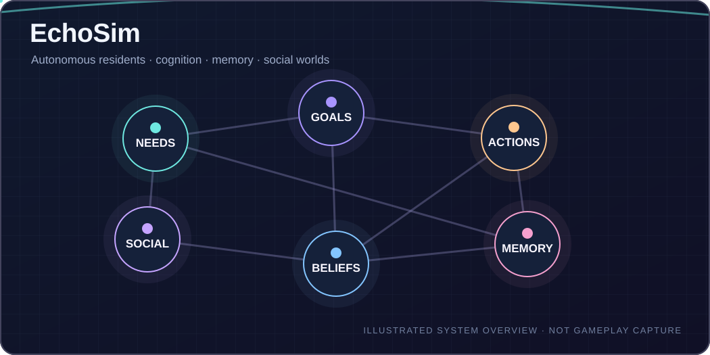
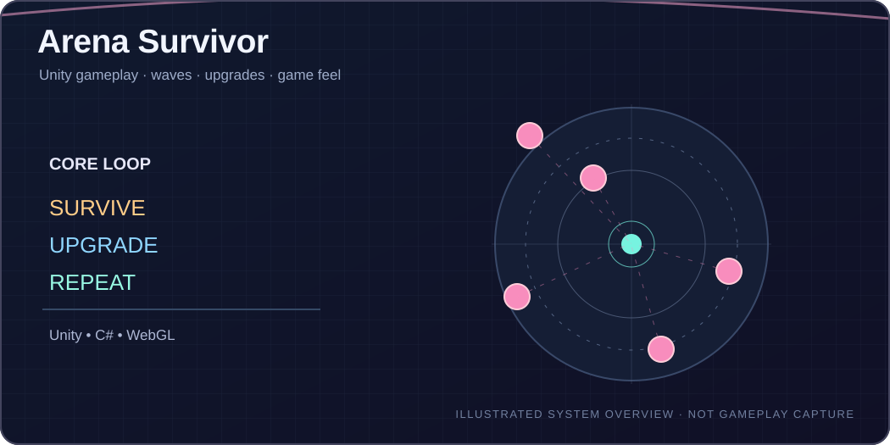
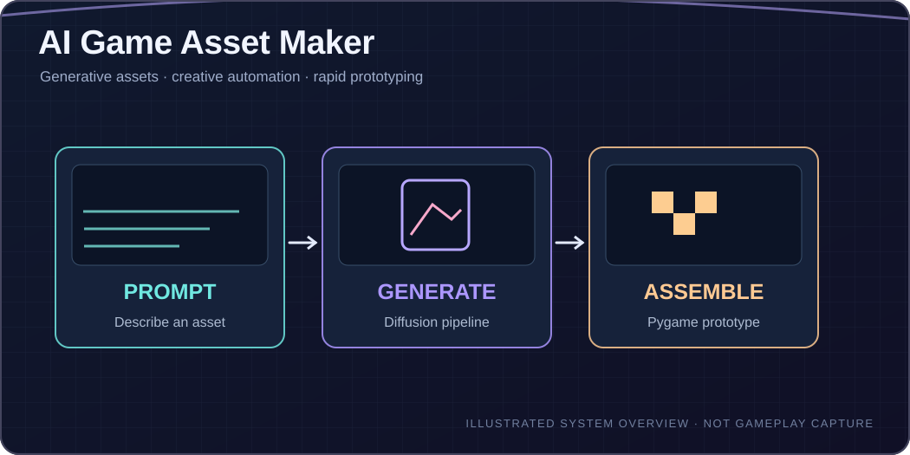

<picture>
  <source media="(prefers-color-scheme: light)" srcset="./assets/hero/aurora-light.svg" />
  <source media="(prefers-color-scheme: dark)" srcset="./assets/hero/aurora-dark.svg" />
  
</picture>

**Game Developer · AI/ML Engineer · Creative Technologist**

[**Portfolio ↗**](https://kaustuvmohapatra.github.io/ResumeSite/) &nbsp;·&nbsp; [**Play my games ↗**](https://kaustuvm.itch.io/) &nbsp;·&nbsp; [**GitHub projects ↗**](https://github.com/KaustuvMohapatra?tab=repositories) &nbsp;·&nbsp; [**LinkedIn ↗**](https://www.linkedin.com/in/kaustuv-mohapatra-b0538428b/)

## Hello, I'm Kaustuv 👋

<table>
<tr><td width="38%" valign="top">

</td><td width="62%" valign="top">

I'm a **Computer Science undergraduate at VIT Vellore**, combining **game development, applied AI and interactive software**.

I work on autonomous simulation systems, playable games and creative AI tools—from residents who remember and form relationships to responsive gameplay mechanics and tools that speed up prototyping.

What connects these projects is my interest in the space between **technical depth and experiences that feel good to use**.

**Interested in:** gameplay programming · AI agents · emergent simulations · human-centered interfaces · creative tooling.

</td></tr>
</table>

## Selected work

My favorite projects involve both engineering challenges and interaction design. Click any illustration for the source code.

<table>
<tr><td width="44%" valign="middle">

</td><td valign="middle">
<h3><a href="https://github.com/KaustuvMohapatra/EchosSim">EchoSim ↗</a></h3>

<strong>Autonomous social simulation · TypeScript · Babylon.js · Phaser</strong>

An engine-independent simulation where residents pursue goals, remember experiences, revise beliefs, and develop relationships. Includes explainable planning and multiple interactive clients.

<a href="https://github.com/KaustuvMohapatra/EchosSim">Architecture &amp; code →</a>

</td></tr>
<tr><td width="44%" valign="middle">

</td><td valign="middle">
<h3><a href="https://github.com/KaustuvMohapatra/Arena-Survivor">Arena Survivor ↗</a></h3>

<strong>Unity · C# · ShaderLab · WebGL</strong>

A playable survival arena centered on combat feedback, enemy waves, automatic weapons, upgrades, and progression.

<a href="https://kaustuvm.itch.io/arena-survivor">Play in browser →</a> · <a href="https://github.com/KaustuvMohapatra/Arena-Survivor">Source →</a>

</td></tr>
<tr><td width="44%" valign="middle">

</td><td valign="middle">
<h3><a href="https://github.com/KaustuvMohapatra/AI-Game-Asset-Maker">AI Game Asset Maker ↗</a></h3>

<strong>Generative AI · Python · FastAPI · Electron · Pygame</strong>

An experiment in closing the gap between text prompts and usable game assets, connecting generation, processing, and prototype assembly.

<a href="https://github.com/KaustuvMohapatra/AI-Game-Asset-Maker">Architecture &amp; code →</a>

</td></tr>
</table>

Project visuals are original illustrative diagrams of their engineering concepts, not captured gameplay screenshots.

### More things I've built

| Project | Focus | Explore |
| :--- | :--- | :--- |
| **[TypeMaker](https://github.com/KaustuvMohapatra/typemaker)** | Typing competition, WPM analytics, and generated prompts | [Live app](https://typemaker-pro.vercel.app/) |
| **[MedLingo](https://github.com/KaustuvMohapatra/MedLingo)** | Gamified revision and spaced repetition | [Live app](https://medlingo-pied.vercel.app/) |
| **[AlexAI](https://github.com/KaustuvMohapatra/AlexAI)** | Conversational AI assistant | [Repository](https://github.com/KaustuvMohapatra/AlexAI) |

## Technologies & creative tools

**Game development & interactive graphics**

Also: Phaser · ShaderLab · Gameplay architecture · WebGL

**Artificial intelligence & data**

Also: Generative AI · Agent planning · Pandas · NumPy · SQL

**Web, backend & developer tools**

Also: REST APIs · CI/CD · Automated testing · Krita · Aseprite

## Beyond the code

- 🎓 **VIT Vellore** — B.Tech in Computer Science and Engineering.
- 🛠️ **TAG Club at VIT** — Senior Core Technical Department Head, contributing to technical development and collaboration.
- 🎮 **Creative engineering** — Interested in gameplay programming, AI-driven worlds and playful, useful digital experiences.

## Let's make something interesting

Whether you're working on a game, an AI application, or an ambitious interactive experience, I'd love to connect.

[**Portfolio**](https://kaustuvmohapatra.github.io/ResumeSite/) · [**Playable games**](https://kaustuvm.itch.io/) · [**GitHub**](https://github.com/KaustuvMohapatra) · [**LinkedIn**](https://www.linkedin.com/in/kaustuv-mohapatra-b0538428b/) · [**Email**](mailto:kaustuv4@outlook.com)

Built with original SVG artwork, simple HTML/Markdown, and a genuine interest in creative software.

